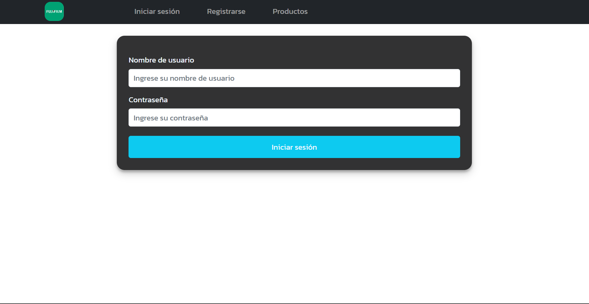
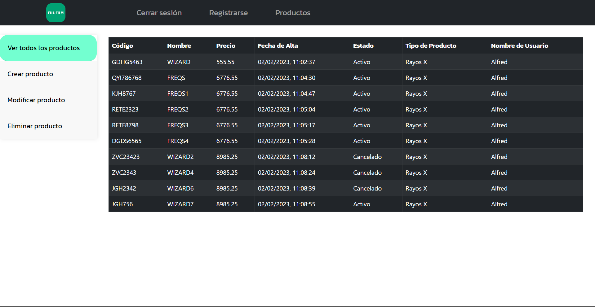
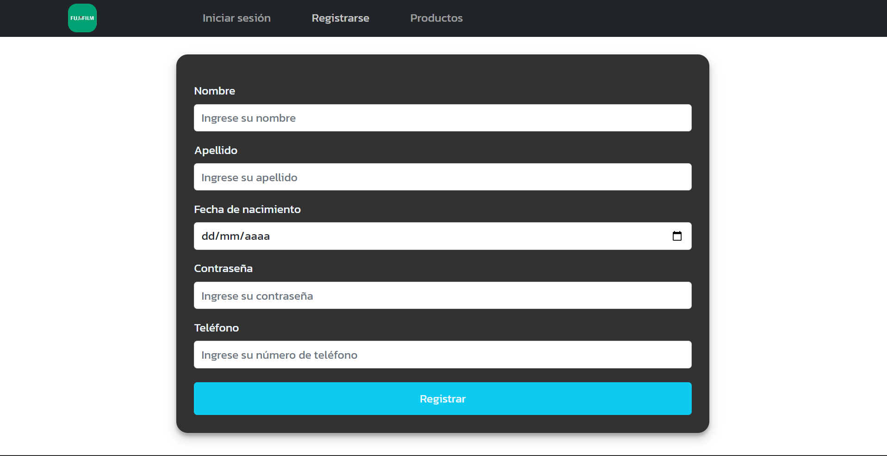
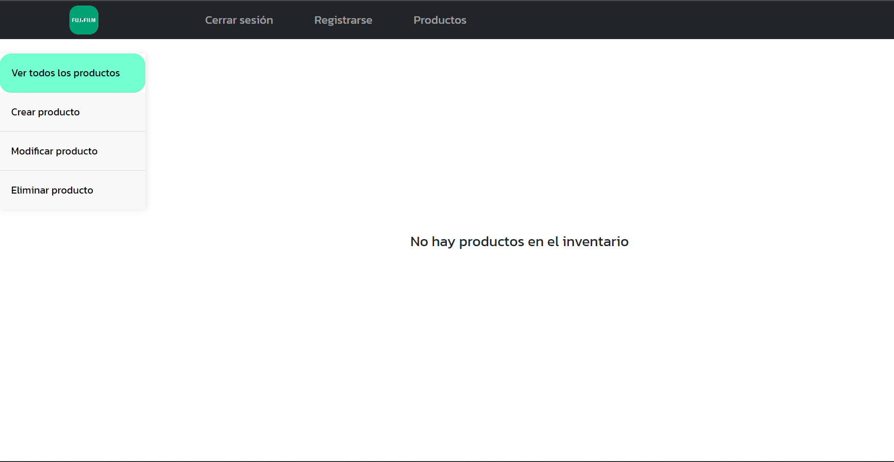
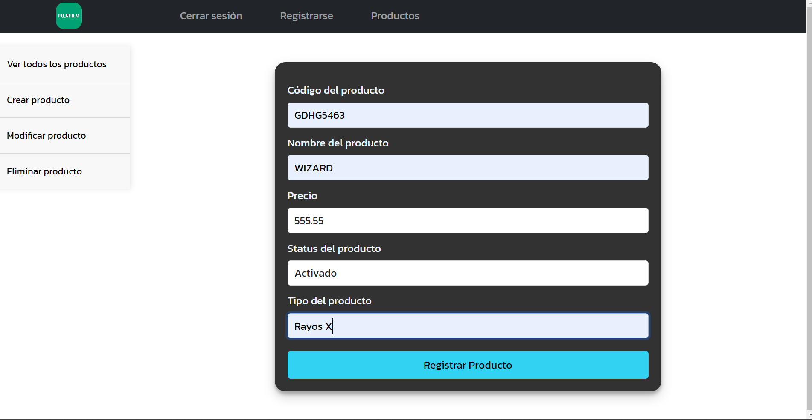
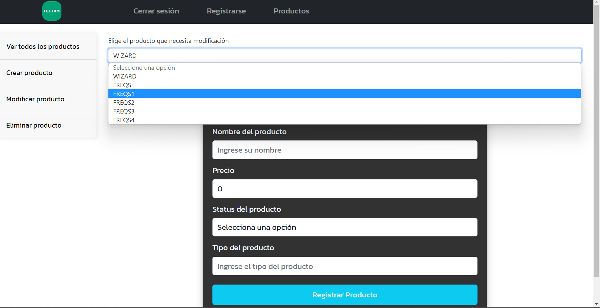
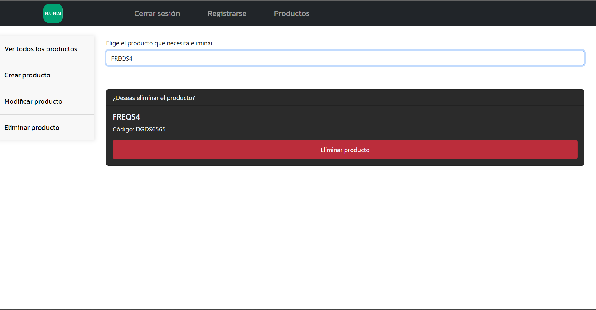

# Fujjifilm

## Introducción:

Este proyecto tiene como objetivo desarrollar una API en el servidor que permita llevar a cabo las operaciones de alta, modificación, 
eliminación lógica y entrega de lista de productos.
La API también registrará y almacenará información de usuarios que accedan al sistema. Además, se desarrollará una aplicación web que permita
la interfaz de usuario con funcionalidades incluyendo una página de inicio de sesión y la recuperación de información de la API para ser mostrada en pantalla.









Sin embargo, todavía quedan varias funcionalidades por implementar antes de considerar que la aplicación está completa. Algunas de las funcionalidades pendientes incluyen:

Mejoras en la sección de inicio de sesión para aumentar la seguridad y la funcionalidad.
Agregar la opción para filtrar los productos.
Mejoras en la visualización de los productos para hacerla más atractiva y fácil de usar.
Implementar la opción de descargar información de los productos en formato de archivo.

## Tecnologías utilizadas:

API:
La estructura de la API fue desarrollada utilizando C# ASP.NET Core Web API y .NET 7.0. Se instalaron los siguientes paquetes Nuget:

Npgsql.EntityFrameworkCore.PostgreSQL
Microsoft.EntityFrameworkCore.Design
Microsoft.EntityFrameworkCore
Microsoft.AspNetCore.OpenApi
Microsoft.AspNetCore.Diagnostics.EntityFrameworkCore

Cliente/Front-end:

Para el lado del cliente se utilizó React y Redux, además de los siguientes paquetes:

Axios
Router-dom
Bootstrap y React-Bootstrap
El proyecto del lado del front-end fue creado utilizando el comando "create-react-app".
Es importante tener en cuenta que las tecnologías utilizadas en este proyecto pueden ser actualizadas o modificadas en el futuro para mejorar la funcionalidad y
el rendimiento del sistema.

## Clonación e Instalación:

Para clonar e instalar este proyecto, siga los siguientes pasos:

Asegúrese de tener instalado Git en su computadora. 
Abra una terminal o línea de comando en el directorio en el que desea clonar el proyecto.

Ejecute el siguiente comando para clonar el repositorio:

```
git clone https://github.com/Alfred-VJ/Fujjifilm.git
```

Una vez clonado el proyecto, acceda a la carpeta del proyecto desde la terminal o línea de comando.

Para instalar las dependencias del proyecto del front, ejecute el siguiente comando en la carpeta client:

```
npm install
```

Para ejecutar el proyecto, ejecute el siguiente comando:
```
npm start
```

Una vez iniciado el proyecto, abra un navegador web y acceda a la dirección http://localhost:3000 para ver la aplicación en funcionamiento.

Se requiera configurar la conexión a la base de datos antes de ejecutar el proyecto. 

La sección ConnectionStrings que encontrarás en el archivo **appsettings.json** contiene la cadena de conexión necesaria para conectarse a la base de datos en modo local. Esta cadena incluye información sobre el servidor, puerto, nombre de la base de datos, usuario y contraseña.

Es importante destacar que la información de la cadena de conexión en este archivo es solo para uso de prueba y debe ser modificada para adaptarse a tu configuración.

# Bienvenido a la aplicación de administración de productos

Esta aplicación tiene un login sencillo al inicio, donde se pide un nombre de usuario y una contraseña. Además, cuenta con una opción para registrarse en caso de que el usuario no tenga una cuenta todavía.

Una vez registrado, el usuario tendrá acceso a la sección de productos, donde podrá crear, modificar y eliminar productos, así como visualizarlos en una lista.

